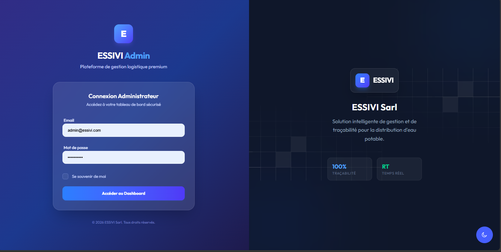
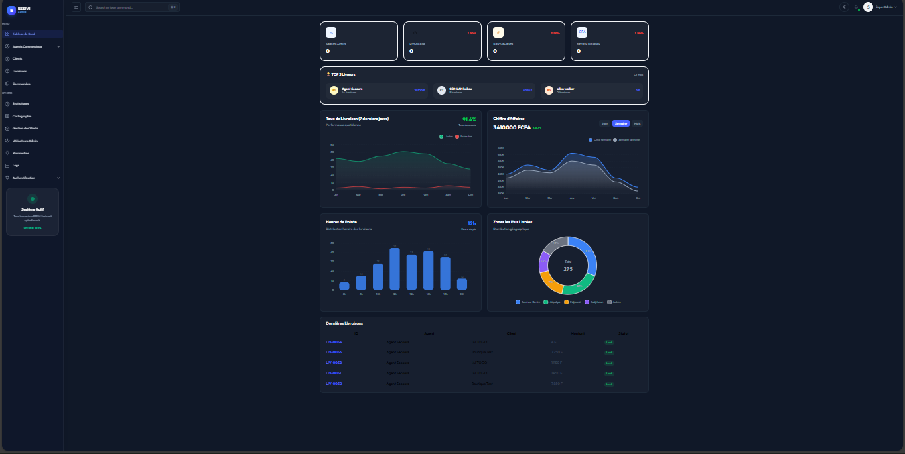
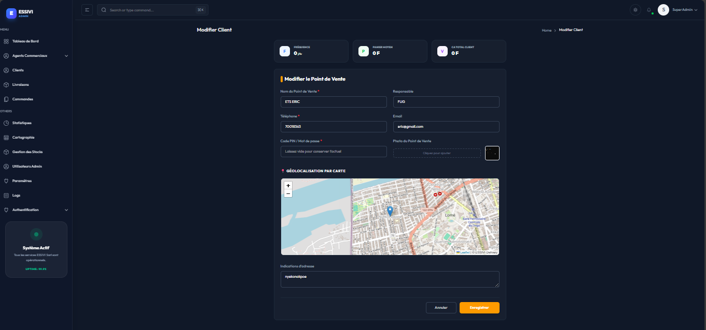
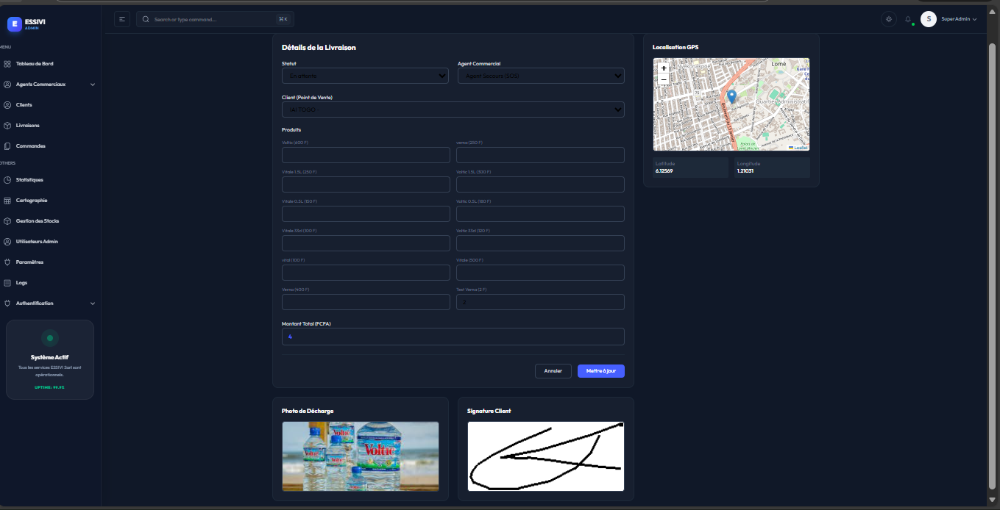
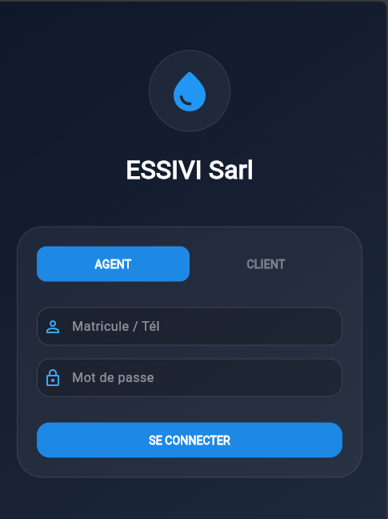
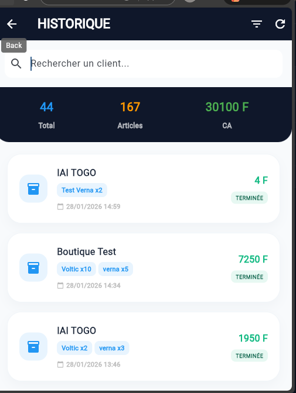
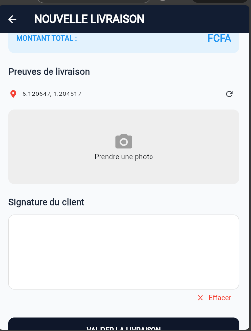
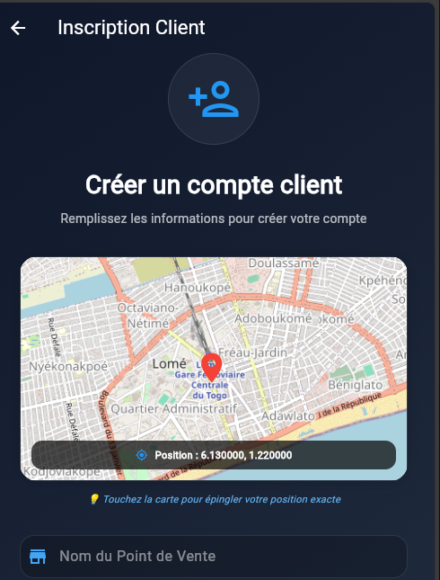

  <h1>💧 Système de Distribution & Logistique (ESSIVI)</h1>
  
<b>Solution Fullstack Premium</b> pour la gestion, le suivi GPS et la distribution d'eau potable en gros.

  
  
  
  

 

## 📸 Aperçu de la Plateforme Web (Admin)

  
  

  
  

## 📱 Aperçu de l'Application Mobile (Agent)

  
  
  
  

## 📄 Contexte du Projet
Développé pour **ESSIVI-Sarl**, ce système modernise la distribution d'eau potable en gros par tricycles. Il assure la traçabilité complète, du départ de l'agent jusqu'à la signature du client final, avec une gestion automatisée du reporting financier.

## ✨ Fonctionnalités Majeures
- **Tracking GPS & Cartographie :** Géolocalisation précise des points de vente et des tournées de livraison (Leaflet/Google Maps).
- **Tableau de Bord Décisionnel :** Analyse en temps réel du CA, des volumes livrés et des performances par agent.
- **Preuves Numériques :** Capture de photos des lieux de décharge et signature électronique du client.
- **Mode Offline First :** L'application mobile permet d'enregistrer les données sans réseau et synchronise dès le retour d'internet.
- **Sécurité Avancée :** Authentification robuste via **JWT** et gestion des rôles (Admin/Gestionnaire/Agent).

## 🛠️ Stack Technique
- **Frontend Web :** React.js (Tailwind CSS, Chart.js, Leaflet)
- **Mobile :** Flutter / Dart
- **Backend :** Python Flask (REST API, SQLAlchemy)
- **Base de données :** PostgreSQL (Données structurées) & MongoDB (Logs/GPS)
- **Outils :** Docker, GitHub Actions, Postman

---

  Développé par <a href="https://github.com/vinsmoke229">Vinsmoke229</a>

